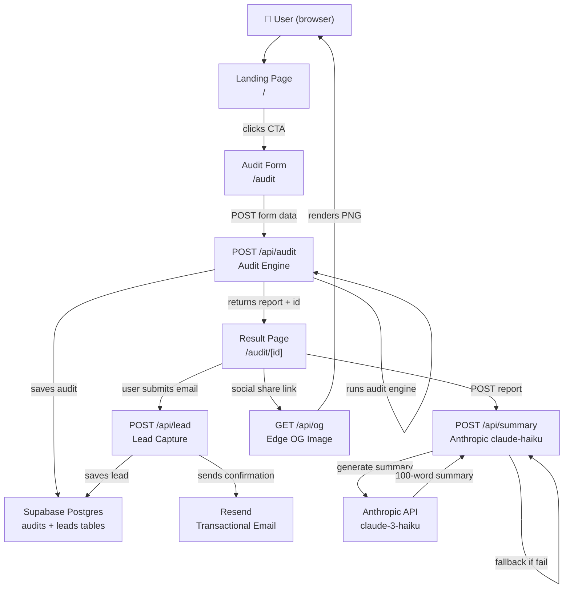

# Architecture — SpendLens

## System Diagram

## Data Flow: Input → Audit Result

1. **User fills audit form** → selects tools, plans, seats, monthly spend, team size, use case. State persists in `localStorage`.

2. **Form submits** → `POST /api/audit` with validated JSON payload.

3. **Audit engine runs** (`lib/audit-engine.ts`) — pure TypeScript, no API calls:
   - For each tool: checks plan fit, seat count, cross-tool alternatives, API spend patterns
   - Priority: plan fix > seat reduction > tool switch > credits > optimal
   - Returns `AuditReport` with per-tool results and totals

4. **Report saved** → Supabase `audits` table with UUID. PII-free (no email at this stage).

5. **Browser navigates** to `/audit/[id]` — the shareable public URL.

6. **AI summary fetched** → `POST /api/summary` with report data → Anthropic claude-haiku → 100-word personalized paragraph. Falls back to template if API fails.

7. **Lead captured** (optional) → User enters email → `POST /api/lead` → stored in Supabase `leads` table → Resend sends confirmation email.

8. **OG preview** → When the shareable URL is pasted on Twitter/Slack, crawlers hit `/api/og?savings=X` → Vercel Edge renders PNG with savings number.

## Why This Stack

| Choice | Rationale |
|---|---|
| **Next.js 14 App Router** | SSR for OG meta tags on shared URLs; API routes in same codebase; Vercel Edge for OG images; TypeScript first-class |
| **TypeScript** | Required. Catches pricing calculation bugs at compile time — a $10 error in the audit engine is a product bug |
| **Tailwind CSS** | Explicitly permitted. Fastest path to consistent, accessible dark UI without custom CSS overhead |
| **Supabase** | Real Postgres (vs Firebase NoSQL), generous free tier, row-level security, excellent TypeScript client |
| **Resend** | Best DX for transactional email at small scale. React Email templates, 3k free/month |
| **Anthropic claude-3-haiku** | Assignment prefers Anthropic. Haiku: fastest, cheapest model. ~$0.0008/summary. Falls back gracefully |
| **Vercel** | Zero-config Next.js deploy, Edge runtime for OG images, automatic HTTPS, PR previews |

## What Changes at 10k Audits/Day

At 10k audits/day (~115/minute), the current architecture hits limits:

1. **Rate limiting**: In-memory rate limiter doesn't scale across serverless instances. Replace with **Upstash Redis** (`@upstash/ratelimit`) — distributed, serverless-compatible.

2. **Supabase**: Free tier caps at 500MB storage and 50k rows. Upgrade to Pro ($25/mo) or self-host on Render. Add database connection pooling via **PgBouncer** (Supabase includes this on Pro).

3. **AI summary**: At $0.0008 per summary × 10k = $8/day — still cheap. Cache summaries in the audit record so repeated page loads don't re-call Anthropic.

4. **OG image generation**: Edge functions are stateless and fast — no change needed. Add CDN caching headers: `Cache-Control: public, max-age=86400`.

5. **Email**: Resend free tier is 3k/month. At 10k/day, 10% lead conversion = 1k emails/day. Move to Resend Pro ($20/month for 50k emails).

6. **Analytics**: Add PostHog (free up to 1M events) to track funnel: form start → tool added → audit run → lead captured.
